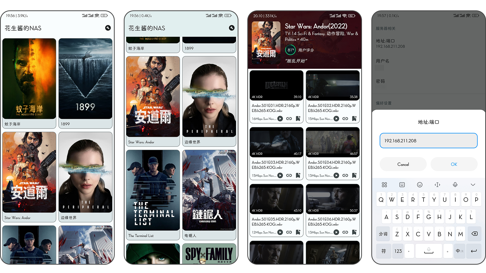
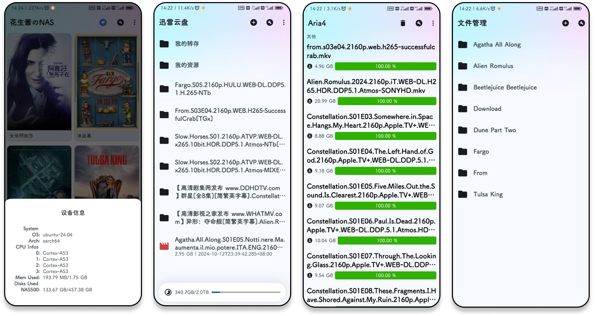
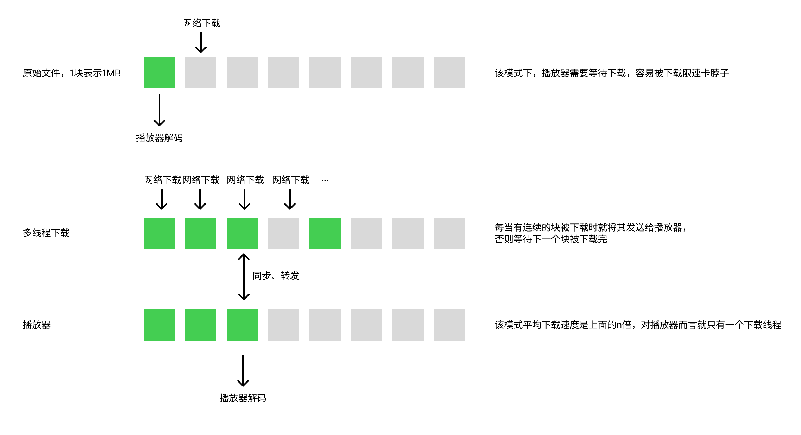

# Hi there 👋 

```
                                                  __                                          
                                                 /\ \__                                       
     _____      __      __       ___     __  __  \ \ ,_\             ___       __       ____  
    /\ '__`\  /'__`\  /'__`\   /' _ `\  /\ \/\ \  \ \ \/   _______ /' _ `\   /'__`\    /',__\ 
    \ \ \L\ \/\  __/ /\ \L\.\_ /\ \/\ \ \ \ \_\ \  \ \ \_ /\______\/\ \/\ \ /\ \L\.\_ /\__, `\
     \ \ ,__/\ \____\\ \__/.\_\\ \_\ \_\ \ \____/   \ \__\\/______/\ \_\ \_\\ \__/.\_\\/\____/
      \ \ \/  \/____/ \/__/\/_/ \/_/\/_/  \/___/     \/__/          \/_/\/_/ \/__/\/_/ \/___/ 
       \ \_\                                                                                  
        \/_/                                                       Created.2021.7.31 by 花生酱啊
       
:( 这是个人使用[golang、kotlin、java、html、python、cpp、js]纯手写的NAS系统（应用程序），目前经历了三次重构；为什么不用黑群晖、飞牛OS？问就是兴趣。
```

💻 **Full-Stack Developer** /  📺 **NAS 爱好者** / 🔨 **纯技术宅（软硬件、破解&刷机）**

## Peanut-NAS

> 一个跨平台的提供NAS服务的软件，可以运行在任何支持Debian、MacOS&Windows操作系统的设备上，当然包括Arm架构。
>

### Overview

> [!NOTE]
> 本页面尽量不涉及任何技术层面的东西，就以论文的形式写一下有什么，是干什么用的。大概有哪些总览可以在[这里](old_projects.md)中看到，虽然大部分功能经过迭代后都取消了开源，或者被整合到其他项目。

### 服务端

> NAS系统的核心支持，通常是链接硬盘的电脑，是NAS的主要硬件。

　　我的最开始的主机是一台树莓派（也可以是闲置的Windows、Mac电脑，甚至是闲置的旧Android手机）和限制的硬盘，现在形态如下：


　　　　　　　　　　　　　　[Fig.]树莓派4B-8GB版（~700元）+ 塔式RGB散热器（~100元）+ 4 * SATA 2.5寸硬盘

　　服务端目前主要提供两大类功能，建议将两者部署在不同的机器上：

　　1. **流媒体服务**

　　2. **相册、重要文件备份功能**：推荐磁盘整列方案

　　流媒体服务最开始就类似于一个文件服务器，是跑在我的旧Android手机上的，流媒体资源也由Android手机上安装的BT软件下载。相册服务是后面有相关需求补上的，也是在这个时候，服务端程序经历了最近的一次重构。
　　总的来说，这部分其实全是代码，没有多少能说的，详细的介绍会写在[这里](go_server.md)。

#### 插曲1-将电视盒子刷Linux运行NAS

> 2024年无意中翻出了电信送的电视盒子，发现是Android系统的，于是研究了刷机的可能性。

　　电视盒子的SoC是晶晨S905L3B（4核A55），一番搜索找到了网友制作的破解的固件包，接下来是按照教程将机器拆开，短接两个触点链接电脑刷机即可：


　　　　　　　　　　　　　　　　　　　　　　　　　　　[Fig.]电视盒子（~0元）

　　刷入固件后就是原生安卓系统了，但是发现没有开启ADB，并且读取U盘有点问题。其实现在就可以作为一个简单的Android电视盒子使用了，但是感觉还是有点鸡肋，于是有了下面刷Linux的研究。

　　对网络上的 `.img` 固件解包，发现就是Android的固件格式。解包后我放入了MT管理器、Termux，顺便整合了原生Android TV 系统启动器，打包后再刷入就可以执行命令了（这里不用这么麻烦，应该可以用FTP下载软件安装）。体验了一下原生的Google TV之后，就准备刷Linux了。将[@ophub](https://github.com/ophub/amlogic-s9xxx-armbian)提供Armbian固件写入U盘，在盒子上执行`reboot update`，重启之后就进入了U盘中的Linux（太强了），到此刷机就完成了，参照仓库里面的教程将Linux写入盒子闪存和初始化即可。

　　经测试，盒子运行我的NAS根本跑不满，性能完全足够，只是搭载了百兆网口和USB 2.0差点意思。连了两个硬盘组RAID后，作为相册和重要文件服务器了。

### Aria4

>  [!NOTE]
> NAS上的文件下载器，负责将文件下载到本地硬盘

　　这部分可选择的并不多，之前使用的Aria2。但是实际体验不尽人意，主要有：

- 只能使用单核
- 单核占用异常大
- 可配置性不高
- 下载的文件碎小，机械硬盘的读写性能不够

　　好在我的需求比较单一，基本只有从Http(s)上下载的情况，于是手写了一个代替Aria2的服务，名为**Aria4**。采用的Golang语言，支持多核和协程。接下来就是手写一个多线程下载器，技术文档见[Aria4](aria4.md)。

　　值得注意的是，对于 `下载的文件碎小，机械硬盘的读写性能不够` 这个问题，Aria4采用的是内存换性能方案。单个线程请求的下载块大小由Aria2的 `1MB` 改为 `16MB~64MB`，如果有24线程，那就会占用 `64MB*24=1.5GB` 内存（内存不够的设备酌情减小参数）。当一个线程下载完后，会将内存中连续的64MB写入机械硬盘，相当于是顺序写入了（当然还是需要依赖操作系统，有可能的话后续直接进行系统调用来顺序写入）。

### 大前端

> 之前截的图，可能有一些项目被重构了。


#### Android 手机端

> [!NOTE]
> 技术性说明文档见[这里](android.md)，看一乐接着看就行。

　　Android 作为主力机，所以NAS主要控制就放在了Android端。





**Features:**

- [x] 流媒体专辑、详情显示、视频播放、自动搜索字幕（迅雷服务支持）
- [x] **\*\***云盘（登录、离线下载、文件取回、文件管理、**在线代理**等）
- [x] NAS 盘文件管理（上传、删除）
- [x] 下载器控制器（查询任务进度、添加任务）

　　说一下**在线代理**功能，这是一个Golang语言编写的跨平台库，运行在Android上。正常使用网盘的在线观看链接是被限制速度的，于是这里写了一个网络工具，原理类似下图：



　　整个就类似于**TCP**中有丢包重传时，等待一个包含完整的`包`的过程，等包完整了再向上传递可应用层，等于是手动模拟了这个过程。该功能在Android设备上的功耗貌似不低，主要出门在外才用，在家里可以部署在NAS上。

### Android TV端

　　2024年购入了TCL T7K电视，于是把电视端也整上了。采用Google推荐的[CLEAN](https://developer.android.google.cn/courses/pathways/android-architecture?hl=zh-cn)架构，所以所有的数据层、网络层都是复用的Android 手机端，界面层采用的Jetpack Compose，因其对TV端天生良好的支持能力。(图是手机上截的，忽略布局问题)


**Features:**

- [x] 流媒体专辑、详情显示、视频播放、自动搜索字幕（迅雷服务支持）
- [ ] **\*\***云盘（登录、离线下载、文件取回、文件管理、**在线代理**等）
- [ ] NAS 盘文件管理（上传、删除）
- [ ] 下载器控制器（查询任务进度、添加任务）

## :octocat: Work Experience

- **Jun 2023 - Present :** Android Developer / Open to new opportunities.

## Connect

- 📧 panrunqiu@outlook.com
